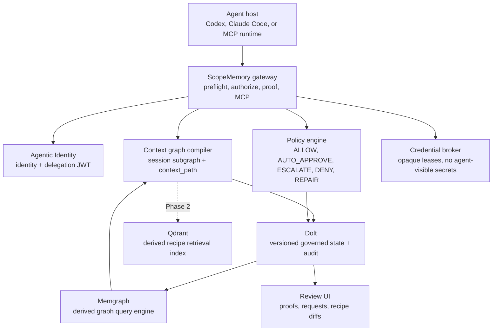

# ScopeMemory

Least-privilege org memory-informed authorization for long horizon multi-agent system

ScopeMemory starts from the reality of long-horizon multi-agent work: agents may
hand tasks to other agents, pause for approvals, resume with new context, and
call many MCP tools over time. Broad credentials make that feel fast at first
and unsafe soon after. ScopeMemory keeps the system moving by turning org memory
into least-privilege authorization.

The authorization layer stays ahead of the agent. As the session unfolds, it
uses the shared context graph to infer the next likely MCP calls and scopes from
similar work done by teammates, their agents, and earlier runs. That lets
ScopeMemory request permissions asynchronously while the agent continues safe
work. When just-in-time grants are available, ScopeMemory scopes them to the
exact tool, resource, TTL, and call count.

The core primitive is a **Workflow Authorization Recipe**: governed memory of
the tools, scopes, resources, credential classes, approval modes, and evidence
that are normal for a class of agent workflow. Recipes turn tribal knowledge
into authorization context: "this kind of customer follow-up usually reads these
Slack channels, creates this kind of Linear issue, and needs these credential
classes." Retrieval and LLM judges contribute candidate facts. The final
approval workflow runs through policy.

Dolt is the versioned source of truth for that memory. Recipes, grants, policy
state, graph edges, and audit records can be branched, diffed, reviewed, merged,
and replayed like code. That matters because access patterns evolve: when a team
learns a safer workflow, ScopeMemory can version the authorization change and
preserve the evidence behind it.

## Why this matters

Long-horizon multi-agent systems need authorization that can move at agent
speed. A human approval can be correct and still arrive too late if the system
only asks for it after an MCP call fails. ScopeMemory uses organizational memory
to anticipate likely access, request it early, and keep the actual grant narrow.

MCP gives this approach a clean enforcement boundary. Tools have names, schemas,
inputs, and structured calls. ScopeMemory uses that structure to keep agents
fast without handing them broad standing access.

ScopeMemory treats authorization as a context path:

```text
session -> recipe -> tool -> scope -> resource -> team <- user <- delegation <- agent
```

That path is the difference between a broad role and a task-scoped decision. A
sales agent preparing a renewal can create a Linear issue for the Sales team
because the accepted recipe predicts that tool and scope for that team-owned
resource. An external Slack post needs a different path: explicit recipe memory,
compatible resource constraints, and human approval.

Policy checks are expressed as Datalog-style facts and rules. That matters for
the approval workflow because each decision reduces to a small, inspectable fact
set satisfying explicit rules. The resulting proof can be hashed, stored,
replayed, and reviewed. In practice, Datalog gives the system a fast path for
predictable work and a mathematically verifiable path for security review when
something unusual happens.

This is where ephemeral auto-approval fits. A predictable low-risk request can
become `AUTO_APPROVE_EPHEMERAL_GRANT` with a bounded scope, resource, TTL, and
call count. Higher-risk requests move to `ESCALATE_HUMAN`; policy violations
return `DENY`; malformed calls return `REPAIR`.

Credential access follows the same shape. Hooks observe MCP tool calls and
normalize the intent before execution. When a call needs a secret, policy can
issue an opaque 1Password-backed credential lease and the broker injects the
credential inside the execution boundary. The agent receives the result of the
authorized tool call while the decrypted credential remains broker-only. In this
repository, the practical zero-knowledge claim is zero secret exposure to agents
and ScopeMemory persistence, which minimizes credential leakage through prompts,
transcripts, tool inputs, logs, Dolt, Qdrant, and UI surfaces.

## Architecture



The design keeps the authority boundaries deliberately boring:

- **Dolt is canonical.** Recipes, policies, graph edges, grants, credential
  references, decisions, and audit hashes need versioned branch, diff, review,
  merge, replay, and historical semantics.
- **The context graph predicts.** Recipes, prior sessions, tool calls, scopes,
  resources, teams, and approvals form a shared graph. The gateway can use the
  current session and current MCP calls to predict likely future calls, then open
  approval work before the agent blocks on a missing permission.
- **Memgraph traverses.** Dolt syncs into Memgraph for ReBAC context paths and
  recipe retrieval. The gateway falls back to an in-process graph when Memgraph
  is unavailable.
- **Qdrant retrieves candidates.** Semantic retrieval helps match new goals to
  prior successful workflows. Hits become useful after they are tied back to
  governed recipe state and policy facts.
- **Policy decides.** CozoDB/Datalog-style facts give the system deterministic
  approvals, ephemeral auto-approvals, denials, escalations, repairs, and
  reproducible proof traces.
- **LLMs propose.** Judges may classify goals, summarize evidence, and propose
  recipes. Their output becomes candidate facts for policy to evaluate.
- **Credentials stay brokered.** 1Password-backed leases let hooks and gateway
  execution inject secrets at call time without placing decrypted values in the
  agent-visible path or persistent ScopeMemory state.

## Tech stack

| Layer | Current | Why |
|-------|---------|-----|
| Demo runtime | Python 3.12 + SQLite | Proves the ReBAC path with no infrastructure tax. |
| Gateway | FastAPI + Uvicorn | HTTP and MCP surfaces for preflight, authorization, proof inspection, and demo apps. |
| Agent identity | Signed delegation JWTs + IAM adapter | Long-horizon agents need identity and bounded delegation before authorization memory can be trusted. |
| Canonical state | Dolt | Authorization memory changes should be versioned, reviewable, mergeable, and replayable as data diffs. |
| Graph query | Memgraph, with in-memory fallback | Relationship traversal is the product mechanic; fallback keeps the demo runnable. |
| Policy | Embedded Cozo Datalog + deterministic fallback | Datalog-style rules make approvals fast, replayable, and mathematically verifiable. |
| Retrieval | Memgraph now, Qdrant planned | Recipe recall needs graph traversal, semantic matching, and payload filters so likely permissions can be requested before the agent stalls. |
| Credentials | 1Password-oriented broker scaffolding | Secrets should be leased into execution and scoped to the authorized call. |
| Hooks | Claude/Codex pre-tool-use normalization | Hooks catch MCP and shell intent at call time, route secret access through the broker, and block direct credential exposure. |
| UI | React, Streamlit policy console, gateway-served demo UI | Reviewers need to see predicted access, approvals, proofs, credential leases, and recipe diffs. |

## Repository layout

```text
demo/                         RFC-07 SQLite terminal demo
platform/                     FastAPI + Dolt + graph + policy prototype
platform/mcp/                 JSON-RPC meta-MCP server
platform/agentic_identity/    delegation JWTs and IAM adapter
platform/person_b/            memory, fixtures, recipe retrieval, learning worker
platform/web/                 React UI
docs/engineering-plan/        RFCs, decisions, research, status
INITIAL_ROUGH_PLAN.md         Original product and architecture sketch
```

Important docs:

- [Engineering plan](docs/engineering-plan/README.md)
- [RFC-00 product architecture](docs/engineering-plan/plan/RFC-00-product-architecture.md)
- [RFC-03 MCP gateway](docs/engineering-plan/plan/RFC-03-mcp-gateway-runtime.md)
- [RFC-07 first demo](docs/engineering-plan/plan/RFC-07-2-hour-agentic-identity-demo.md)
- [RFC-08 Agentic Identity integration](docs/engineering-plan/plan/RFC-08-agentic-identity-integration.md)
- [Phase 2 build plan](docs/engineering-plan/plan/RFC-06-demo-build-plan.md)
- [Decision log](docs/engineering-plan/decisions.md)

## Development

Run the no-dependency demo:

```bash
cd demo
python run_demo.py all
```

Run the platform stack:

```bash
cd platform
python3 init_dolt_user.py
./run_stack.sh
```

Run focused tests:

```bash
PYTHON="$(command -v python3)"
"$PYTHON" platform/tests/test_cozo_policy.py
"$PYTHON" platform/test_authorization_checks.py
"$PYTHON" platform/test_runtime_context_graph.py
"$PYTHON" platform/test_mcp_gateway.py
env PATH=/usr/bin:/bin "$PYTHON" platform/test_credential_hooks.py
```

The platform Python dependencies are listed in
[`platform/requirements.txt`](platform/requirements.txt). The React UI
dependencies live in [`platform/web/package.json`](platform/web/package.json).

## Contributing

Keep changes grounded in the RFCs and decision log. The project uses `bd`
(Beads) for durable task state, so run `bd prime` before starting a work session
and use Beads for follow-up work instead of ad hoc TODO files.

When changing behavior, include a runnable verification path. For the demo,
`python demo/run_demo.py all` should remain fast and dependency-free. For the
platform, keep proof shape stable: decisions should include a reason, facts,
`context_path`, and an audit/proof record.

## License

No license file is present yet.
