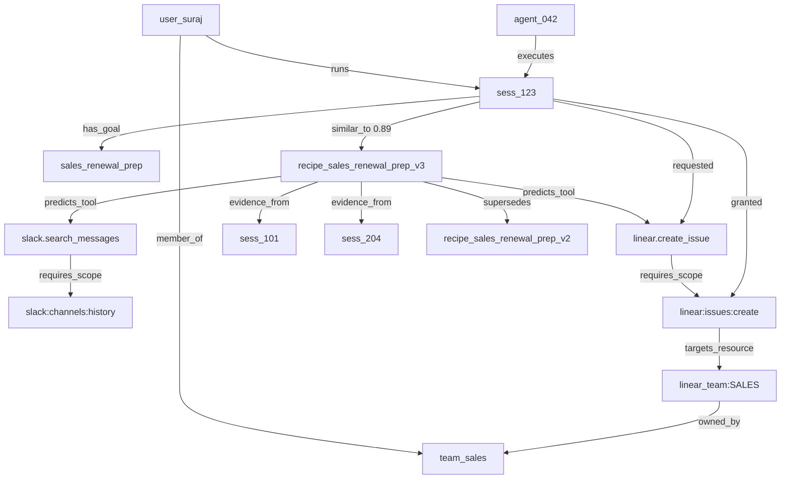

# RFC-01: Domain Model And Data

## Status

**First build:** RFC-07 demo schema (11 SQLite tables in `demo/schema.sql`).  
**This document:** full Phase 2 domain model (24 Dolt tables).

## Demo Data Model (RFC-07 binding)

Build only these tables for the 2-hour demo. Full definitions in `demo/schema.sql`.

| Table | ReBAC role |
|-------|------------|
| `users`, `teams`, `user_teams` | `member_of` |
| `agents` | Agentic-IAM identity mirror (`identity_ref`, `trust_score`) |
| `sessions` | Bounded run + `goal_class` |
| `delegations` | `user#delegates@agent@session` |
| `workflow_recipes`, `recipe_tools`, `recipe_scopes` | Memory + `predicts_*` |
| `resources` | `owned_by` + `external` flag |
| `grants` | Ephemeral session grants |
| `tool_scopes` | Tool → scope mapping (demo shortcut) |

Recipe match in demo: **exact `goal_class` equality** (no Qdrant).

Promotion to full RFC-01: swap SQLite → Dolt, add graph snapshot tables, credential tables, audit chain.

## Core Domain Terms

### Session

A bounded agent run with a user, team, agent identity, signed goal, visible tools, grants, credential leases, events, and final outcome.

### Workflow Authorization Recipe

A governed memory record that says: for this team and goal class, agents normally use these tools, scopes, resources, credential classes, approval modes, limits, and evidence.

### Access Request

A request to grant a missing scope or resource constraint for a session. It can be auto-approved, human-approved, denied, expired, or revoked.

### Grant

A short-lived authorization object bound to session, scope, resource constraint, tool, TTL, issuer, and proof.

### Credential Reference

An opaque pointer to a secret in a provider such as 1Password. The reference is metadata, not the secret value.

### Credential Binding

A policy object that maps a tool/scope/resource class to an acceptable credential reference or provider class.

### Credential Lease

A short-lived runtime permission for the broker to resolve a credential reference for a specific session, tool, scope, resource, and execution adapter.

### Memory Data Context Graph

The governed graph of authorization-memory entities and typed relationships. Dolt stores canonical nodes and edges. Qdrant contributes derived semantic `similar_to` edges between session goals and accepted recipes. The gateway materializes a session context subgraph on every preflight and tool call.

### Session Context Subgraph

The materialized slice of the Memory Data Context Graph relevant to one session at one decision phase (`preflight`, `tool_call`, or `post_call`). Stored as `session_context_snapshots.subgraph_json` and projected into Datalog facts before policy evaluation.

### Context Path

An ordered traversal from session through recipe, tool, scope, and resource that justifies a specific authorization decision. Every `ALLOW` or `AUTO_APPROVE_EPHEMERAL_GRANT` decision must cite at least one valid context path in v1.

## Memory Data Context Graph

ScopeMemory authorization memory is inherently relational. A Workflow Authorization Recipe is not an isolated document; it sits in a graph of users, teams, sessions, tools, scopes, resources, grants, approvals, and audit events.

The graph answers:

```text
Given this user, team, session goal, and current grants,
what recipes, tools, scopes, resources, approvals, and prior sessions
are in context — and how did we reach that conclusion?
```

### Design Rules

- Dolt is the canonical store for graph nodes and edges.
- Qdrant provides semantic recall; every `similar_to` edge used in a decision must be reified in `session_recipe_similarity` with `qdrant_point_id` and `dolt_commit_hash`.
- The gateway builds the session context subgraph before compiling policy facts.
- LLM judges may propose candidate graph edges with confidence; policy treats them as untrusted until validated against Dolt or accepted recipe state.
- Graph traversal may be implemented as SQL joins over Dolt edge tables in v1. A derived graph query engine (for example CozoDB) is optional and must not become the source of truth.

### Node Kinds

| Node kind | Example ID | Backing store |
|-----------|------------|---------------|
| `User` | `user_suraj` | `users` |
| `Team` | `team_sales` | `teams` |
| `Agent` | `agent_042` | session metadata |
| `Session` | `sess_123` | `sessions` |
| `GoalClass` | `sales_renewal_prep` | `workflow_recipes.goal_class` or classifier output |
| `Recipe` | `recipe_sales_renewal_prep_v3` | `workflow_recipes` |
| `MCPServer` | `mcp_linear` | `mcp_servers` |
| `MCPTool` | `linear.create_issue` | `mcp_tools` |
| `Scope` | `linear:issues:create` | scope vocabulary |
| `Resource` | `linear_team:SALES` | resource registry |
| `Grant` | `grant_sess123_linear_create` | `grants` |
| `AccessRequest` | `req_884` | `access_requests` |
| `Approval` | `appr_221` | access request approver fields |
| `AuditEvent` | `evt_9912` | `session_events`, `policy_decisions` |
| `CredentialRef` | `credref_slack_bot_sales` | `credential_refs` |
| `PolicyRule` | `rule_no_external_slack` | policy catalog |

### Edge Kinds

| Edge kind | From → To | Payload | Primary source |
|-----------|-----------|---------|----------------|
| `member_of` | User → Team | role, since | `user_teams` |
| `runs` | User → Session | started_at | `sessions` |
| `executes` | Agent → Session | agent_version | `sessions` |
| `has_goal` | Session → GoalClass | raw_goal_text, goal_hash | `sessions` |
| `similar_to` | Session → Recipe | cosine_score, rank, index_commit | Qdrant + `session_recipe_similarity` |
| `predicts_tool` | Recipe → MCPTool | typical_order, required | `recipe_tools` |
| `predicts_scope` | Recipe → Scope | approval_mode, max_ttl | `recipe_scopes` |
| `predicts_credential` | Recipe → CredentialRef | binding_mode, required | `recipe_credentials` |
| `requires_scope` | MCPTool → Scope | resource_kind, access_kind | `tool_required_scopes` |
| `targets_resource` | Scope → Resource | constraint_json | resource metadata |
| `owned_by` | Resource → Team | visibility | resource registry |
| `requested` | Session → MCPTool | call_id, schema_hash | runtime |
| `granted` | Session → Scope | resource, ttl, issuer | `grants` |
| `authorized_by` | Grant → Approval | approver_type, proof_ref | `access_requests` |
| `bound_to` | MCPTool → CredentialRef | lease_id | `credential_bindings`, `credential_leases` |
| `evidence_from` | Recipe → Session | evidence_type, score | `recipe_evidence` |
| `supersedes` | Recipe → Recipe | dolt_commit, reason | recipe lineage |
| `invoked` | Session → MCPTool | latency_ms, outcome | `session_events` |
| `produced` | MCPTool → AuditEvent | decision, fact_set_hash | `policy_decisions` |

### Example Subgraph



### Gateway Query Patterns

These traversals are binding contracts for the gateway fact compiler:

```text
context.recipes_for_session(session_id)
  Session -[similar_to]-> Recipe
  WHERE Recipe.status = 'accepted'
  AND Recipe.team_id = Session.team_id
  ORDER BY similarity DESC LIMIT 5

context.missing_scopes(session_id, tool_id)
  Session -[requested]-> Tool -[requires_scope]-> Scope
  MINUS Session -[granted]-> Scope

context.resource_allowed(session_id, resource_id)
  Session -[member_of*]-> Team
  Resource -[owned_by]-> Team

context.proof_chain(session_id, tool_call_id)
  Session -[invoked]-> Tool -[produced]-> AuditEvent
  AuditEvent -[derived_from]-> {Grant, Approval, Recipe, PolicyRule}

context.recipe_lineage(recipe_id)
  Recipe -[supersedes*]-> Recipe
  Recipe -[evidence_from]-> Session
```

### Preflight Traversal

For each `auth.preflight_goal` call:

```text
1. Start at Session(session_id)
2. Walk member_of → Team for policy boundary
3. Walk similar_to → Recipe via Qdrant hit reified in session_recipe_similarity
4. Expand predicts_tool, predicts_scope, predicts_credential, requires_scope, targets_resource
5. Compare required scopes against Session → granted edges
6. Emit AccessRequest nodes for missing scopes
7. Persist session_context_snapshot with subgraph_json and fact_set_hash
8. Project subgraph to Datalog facts
9. Return narrowed tool catalog
```

### Relational Projection

Most graph edges are derived from relational tables rather than stored redundantly. The gateway and indexing workers maintain `graph_nodes` and `graph_edges` for traversals that are expensive to reconstruct or require provenance metadata. Minimum required reification:

| Edge kind | Must be reified when used in a decision |
|-----------|----------------------------------------|
| `similar_to` | Always — via `session_recipe_similarity` |
| `supersedes` | When comparing recipe versions |
| `invoked` / `produced` | Always — via `session_events` and `policy_decisions` |
| `predicts_*`, `requires_scope`, `member_of` | May be computed from relational joins in v1 |

## Dolt Tables

The schema below is binding at the concept level. Names and relationships should survive implementation; exact SQL types may change.

```sql
CREATE TABLE users (
  user_id VARCHAR(128) PRIMARY KEY,
  email VARCHAR(255) NOT NULL,
  display_name VARCHAR(255),
  status VARCHAR(32) NOT NULL
);

CREATE TABLE teams (
  team_id VARCHAR(128) PRIMARY KEY,
  name VARCHAR(255) NOT NULL,
  owner_team_id VARCHAR(128),
  status VARCHAR(32) NOT NULL
);

CREATE TABLE user_teams (
  user_id VARCHAR(128) NOT NULL,
  team_id VARCHAR(128) NOT NULL,
  role VARCHAR(64) NOT NULL,
  PRIMARY KEY (user_id, team_id)
);

CREATE TABLE mcp_servers (
  server_id VARCHAR(128) PRIMARY KEY,
  name VARCHAR(255) NOT NULL,
  transport VARCHAR(64) NOT NULL,
  base_url TEXT,
  status VARCHAR(32) NOT NULL
);

CREATE TABLE mcp_tools (
  tool_id VARCHAR(128) PRIMARY KEY,
  server_id VARCHAR(128) NOT NULL,
  tool_name VARCHAR(255) NOT NULL,
  input_schema_json JSON NOT NULL,
  output_sensitivity VARCHAR(64) NOT NULL,
  risk_level VARCHAR(32) NOT NULL,
  status VARCHAR(32) NOT NULL
);

CREATE TABLE tool_required_scopes (
  tool_id VARCHAR(128) NOT NULL,
  scope VARCHAR(255) NOT NULL,
  resource_kind VARCHAR(128) NOT NULL,
  access_kind VARCHAR(64) NOT NULL,
  PRIMARY KEY (tool_id, scope, resource_kind)
);

CREATE TABLE workflow_recipes (
  recipe_id VARCHAR(128) PRIMARY KEY,
  title TEXT NOT NULL,
  team_id VARCHAR(128) NOT NULL,
  goal_class VARCHAR(128) NOT NULL,
  goal_pattern TEXT NOT NULL,
  status VARCHAR(32) NOT NULL,
  confidence DOUBLE NOT NULL,
  risk_level VARCHAR(32) NOT NULL,
  owner_team_id VARCHAR(128) NOT NULL,
  valid_from DATETIME NOT NULL,
  valid_until DATETIME,
  created_at DATETIME NOT NULL,
  updated_at DATETIME NOT NULL
);

CREATE TABLE recipe_tools (
  recipe_id VARCHAR(128) NOT NULL,
  tool_id VARCHAR(128) NOT NULL,
  typical_order INT,
  required BOOLEAN NOT NULL,
  PRIMARY KEY (recipe_id, tool_id)
);

CREATE TABLE recipe_scopes (
  recipe_id VARCHAR(128) NOT NULL,
  scope VARCHAR(255) NOT NULL,
  approval_mode VARCHAR(64) NOT NULL,
  resource_constraint_json JSON NOT NULL,
  max_ttl_seconds INT NOT NULL,
  max_call_count INT,
  PRIMARY KEY (recipe_id, scope)
);

CREATE TABLE recipe_credentials (
  recipe_id VARCHAR(128) NOT NULL,
  credential_class VARCHAR(128) NOT NULL,
  binding_mode VARCHAR(64) NOT NULL,
  required BOOLEAN NOT NULL,
  notes TEXT,
  PRIMARY KEY (recipe_id, credential_class)
);

CREATE TABLE recipe_evidence (
  recipe_id VARCHAR(128) NOT NULL,
  session_id VARCHAR(128) NOT NULL,
  evidence_type VARCHAR(64) NOT NULL,
  summary TEXT NOT NULL,
  score DOUBLE,
  accepted_by VARCHAR(128),
  created_at DATETIME NOT NULL,
  PRIMARY KEY (recipe_id, session_id, evidence_type)
);

CREATE TABLE credential_providers (
  provider_id VARCHAR(128) PRIMARY KEY,
  provider_type VARCHAR(64) NOT NULL,
  display_name VARCHAR(255) NOT NULL,
  trust_boundary VARCHAR(64) NOT NULL,
  status VARCHAR(32) NOT NULL
);

CREATE TABLE credential_refs (
  credential_ref_id VARCHAR(128) PRIMARY KEY,
  provider_id VARCHAR(128) NOT NULL,
  credential_class VARCHAR(128) NOT NULL,
  owner_team_id VARCHAR(128) NOT NULL,
  secret_ref_ciphertext_or_handle TEXT NOT NULL,
  secret_ref_hash VARCHAR(128) NOT NULL,
  display_hint TEXT,
  rotation_hint DATETIME,
  sensitivity VARCHAR(64) NOT NULL,
  status VARCHAR(32) NOT NULL
);

CREATE TABLE credential_bindings (
  binding_id VARCHAR(128) PRIMARY KEY,
  credential_ref_id VARCHAR(128) NOT NULL,
  tool_id VARCHAR(128) NOT NULL,
  scope VARCHAR(255) NOT NULL,
  resource_constraint_json JSON NOT NULL,
  injection_mode VARCHAR(64) NOT NULL,
  max_ttl_seconds INT NOT NULL,
  status VARCHAR(32) NOT NULL
);

CREATE TABLE sessions (
  session_id VARCHAR(128) PRIMARY KEY,
  user_id VARCHAR(128) NOT NULL,
  team_id VARCHAR(128) NOT NULL,
  agent_id VARCHAR(128) NOT NULL,
  goal TEXT NOT NULL,
  goal_hash VARCHAR(128) NOT NULL,
  goal_signature TEXT,
  started_at DATETIME NOT NULL,
  ended_at DATETIME,
  status VARCHAR(64) NOT NULL
);

CREATE TABLE access_requests (
  request_id VARCHAR(128) PRIMARY KEY,
  session_id VARCHAR(128) NOT NULL,
  user_id VARCHAR(128) NOT NULL,
  agent_id VARCHAR(128) NOT NULL,
  requested_scope VARCHAR(255) NOT NULL,
  requested_resource TEXT NOT NULL,
  requested_tool_id VARCHAR(128) NOT NULL,
  credential_binding_id VARCHAR(128),
  reason TEXT NOT NULL,
  recipe_id VARCHAR(128),
  status VARCHAR(64) NOT NULL,
  approver_type VARCHAR(64),
  approver_id VARCHAR(128),
  expires_at DATETIME,
  created_at DATETIME NOT NULL
);

CREATE TABLE grants (
  grant_id VARCHAR(128) PRIMARY KEY,
  session_id VARCHAR(128) NOT NULL,
  scope VARCHAR(255) NOT NULL,
  resource_constraint_json JSON NOT NULL,
  tool_id VARCHAR(128),
  issued_by VARCHAR(128) NOT NULL,
  issued_reason TEXT NOT NULL,
  max_call_count INT,
  used_call_count INT NOT NULL,
  expires_at DATETIME NOT NULL,
  revoked_at DATETIME
);

CREATE TABLE credential_leases (
  lease_id VARCHAR(128) PRIMARY KEY,
  session_id VARCHAR(128) NOT NULL,
  grant_id VARCHAR(128) NOT NULL,
  credential_ref_id VARCHAR(128) NOT NULL,
  credential_binding_id VARCHAR(128) NOT NULL,
  injection_mode VARCHAR(64) NOT NULL,
  issued_by VARCHAR(128) NOT NULL,
  provider_request_id VARCHAR(255),
  expires_at DATETIME NOT NULL,
  used_at DATETIME,
  revoked_at DATETIME,
  secret_exposed_to_agent BOOLEAN NOT NULL DEFAULT FALSE
);

CREATE TABLE policy_decisions (
  decision_id VARCHAR(128) PRIMARY KEY,
  session_id VARCHAR(128) NOT NULL,
  tool_id VARCHAR(128),
  decision VARCHAR(64) NOT NULL,
  proof_json JSON NOT NULL,
  dolt_commit_hash VARCHAR(128) NOT NULL,
  qdrant_hits_json JSON,
  credential_lease_id VARCHAR(128),
  created_at DATETIME NOT NULL
);

CREATE TABLE session_events (
  event_id VARCHAR(128) PRIMARY KEY,
  session_id VARCHAR(128) NOT NULL,
  event_type VARCHAR(64) NOT NULL,
  event_json JSON NOT NULL,
  prev_event_hash VARCHAR(128),
  event_hash VARCHAR(128) NOT NULL,
  created_at DATETIME NOT NULL
);

CREATE TABLE graph_nodes (
  node_id VARCHAR(128) PRIMARY KEY,
  node_kind VARCHAR(64) NOT NULL,
  ref_id VARCHAR(128) NOT NULL,
  dolt_commit_hash VARCHAR(128),
  created_at DATETIME NOT NULL,
  UNIQUE (node_kind, ref_id)
);

CREATE TABLE graph_edges (
  edge_id VARCHAR(128) PRIMARY KEY,
  src_node_id VARCHAR(128) NOT NULL,
  dst_node_id VARCHAR(128) NOT NULL,
  edge_kind VARCHAR(64) NOT NULL,
  payload_json JSON,
  confidence DOUBLE,
  valid_from DATETIME NOT NULL,
  valid_until DATETIME,
  provenance VARCHAR(128) NOT NULL,
  created_at DATETIME NOT NULL
);

CREATE TABLE session_recipe_similarity (
  session_id VARCHAR(128) NOT NULL,
  recipe_id VARCHAR(128) NOT NULL,
  similarity_score DOUBLE NOT NULL,
  rank INT NOT NULL,
  qdrant_point_id VARCHAR(128),
  dolt_commit_hash VARCHAR(128) NOT NULL,
  created_at DATETIME NOT NULL,
  PRIMARY KEY (session_id, recipe_id)
);

CREATE TABLE session_context_snapshots (
  snapshot_id VARCHAR(128) PRIMARY KEY,
  session_id VARCHAR(128) NOT NULL,
  phase VARCHAR(32) NOT NULL,
  subgraph_json JSON NOT NULL,
  fact_set_hash VARCHAR(128) NOT NULL,
  policy_decision_id VARCHAR(128),
  created_at DATETIME NOT NULL
);
```

`session_context_snapshots.phase` must be one of: `preflight`, `tool_call`, `post_call`.

`session_context_snapshots.subgraph_json` stores the materialized nodes and edges used for a decision. The human UI and `auth.show_decision_proof` render this subgraph as the primary proof visualization.

`graph_edges.provenance` must be one of: `dolt`, `qdrant`, `gateway`, `judge`.

## Secret Reference Rules

`credential_refs.secret_ref_ciphertext_or_handle` may contain:

- A provider handle encrypted to the broker.
- A provider-specific stable ID.
- A secret reference such as `op://vault/item/field` only when policy allows that metadata to be stored.

It must not contain a decrypted token, password, private key, `.env` file, or bearer credential.

## Qdrant Payloads

Qdrant points are derived from accepted recipe chunks. Payloads may include:

- `recipe_id`
- `team_id`
- `goal_class`
- `tools`
- `scopes`
- `credential_classes`
- `risk_level`
- `owner_team_id`
- `status`
- `valid_until`
- `dolt_commit`
- `content_hash`
- `embedding_model`
- `embedding_version`

Semantic recall produces candidate `similar_to` edges. The gateway must write accepted hits to `session_recipe_similarity` before those edges participate in policy facts or auto-approval.

Payloads must not include:

- secret references if sensitive.
- decrypted credentials.
- raw session transcript.
- raw customer content.
- unreviewed proposed recipes in the normal retrieval collection.

## Branch Model

```text
main
  accepted policies, tool mappings, recipes, and credential metadata

proposal/recipe-sales-renewal-v4
  candidate recipe from learning worker

proposal/policy-external-slack-deny
  policy change under review

proposal/credential-binding-linear-sales
  credential binding metadata under owner/security review
```

Only `main` feeds the normal authorization retrieval index. Proposal branches are visible in review UI but not used for auto-approval.
